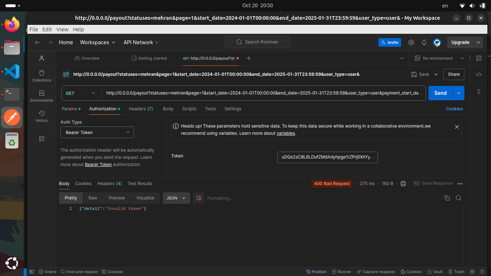

### داکیومنت الگوریتم توسعه
#### مهران علم‌بیگی - پاییز ۱۴۰۳
--------

### مرحله صفر - نصب نیازمندی ها و محیا کردن شرایط

بنده برای شروع ابتدا یک محیط مجازی venv ایجاد کردم و وابستگی های موردنیاز را نصب کردم. وابستگی های نصب شده بدین شرح است:

> [requirements](requirements.txt)

و درنهایت محیط docker-desktop را طبق داکیومنت روی سیستم نصب کردم. مشخصات سیستم من بدین شرح است

##### سیستم عامل: `ubuntu 24.08 LTS`

سپس بعد از نصب ابزار های موردنیاز اقدام به ایجاد یک ساختار منظم کردم و فایل ها را با تفکیک وظایف فولدر بندی کردم سپس فایل های [dockerfile](dockerfile), [docker-compose](docker-compose.yml) رو ایجاد کردم و محیط مجازی را در فایل .gitignore قرار دادم

```bash
.
├── app
│   ├── d_1.py
│   ├── d_2.py
│   ├── __init__.py
│   ├── main.py
│   └── tools.py
├── dockerfile
├── docker-compose.yml
├── doocument.md
├── env
└── requirements.txt
```
-----

### مرحله اول - اجرا کردن پروژه روی بستر داکر و postman

برای اجرا کردن پروژه بر بستر داکر ابتدا `dockerfile` را ایجاد کردم و سپس با دستور `docker build -t mehran .` یک ایمیج به نام خودم ساختم. این ایمیج درواقع یک کپی کلی از برنامه و وابستگی های آن را تولید میکنه که در ادامه این ایمیج هستش که روی یک کانتینر سوار میشه و پروژه روی آدرس `0.0.0.0:80` قرار میگیره.

ایجاد یک کانتینر: ‍`docker run -d --name alam -p 80:80 mehran` (برای app)

بعد از اجرای برنامه فایل داکر کامپوز خودم رو ایجاد کردم و ۲ سرویس [image:fast-api-app و mongodb] رو واردش کردم.

```yml
depends_on:
      - Mongodb
# ایجاد وابستگی image fastapi برای اجرا به دیتابیس
```


من برای درک بهتر وظیفه هر فایل رو اینجا یادداشت خواهم کرد:

- d_2.py: مربوط به ساخت دیتابیس mongodb
- d_1.py: احرازهویت کاربر - دریافت و بررسی توکن های ارسالی از jwt و ایمیل
- main.py: فایل اصلی پروژه fastapi برای تنظیم روتر و اندپوینت و درگاه

فایل های d_1.py و d_2.py به این دلیل که به صورت یک module داخل بخش های مختلف پروژه ایمپورت شدند را وارد دایرکتوری [helper/](app/helper/) کردم برای مدیریت بهتر و دسترسی راحت تر. بعد از ساخت ایمیج نیاز داریم تا کانتیر app رو با دیتابیس جدا کنیم برای اینکار از networking استفاده میکنیم و دستور docker network create mehranalam را اجرا میکنیم. و سپس یک کانتیر برای دیتابیس مونگو خودمون ایجاد میکنیم و بعد از اجرا اون رو به شبکه یا network که ساختیم ادد میکنیم. البته یکسری متغیر ها باید همزمان با اتصال کانتینر به شبکه ایجاد کنیم :

**(همه این اتفاقات داخل فایل [docker-compose.yml](docker-compose.yml) مدیریت شده است)**

```yml
networks:
  app-network:
    driver: bridge
```
سپس با دستور `sudo docker-compose build` فایل داکر-کامپوزمون رو بیلد میکنیم که مشکلی نباشه خروجی هم انتظار میره که:

```bash
Mongodb uses an image, skipping
fastapi-app uses an image, skipping
```

این باشه پس اگه مشکلی نبود درنهایت دستور `sudo docker-compose up`را اجرا میکنیم . که در این مرحله نیاز داریم توی اکانت داکرمون لاگین کنیم. و آخرین ورژن موجود mongodb را pull میکنیم.

```bash
Pulling Mongodb (mongo:latest)...
latest: Pulling from library/mongo
```

و درنهایت با پاس دادن اطلاعات تستی به اندپوینت payout `query` زیر را پر میکنیم:

`http://0.0.0.0:80/payout?statuses=mehran&page=1&start_date=2024-01-01T00:00:00&end_date=2025-01-31T23:59:59&user_type=user&payment_start_date=2024-01-05T00:00:00&payment_end_date=2026-01-20T23:59:59`


بعد از ارسال درخواست به این ارور برخوردم

```bash
INFO:     172.17.0.1:48096 - "GET /payout?statuses=mehran&page=0&start_date=2024-01-01&end_date=2025-01-31&user_type=user&payment_start_date=2024-01-05&payment_end_date=2026-01-20 HTTP/1.1" 422 Unprocessable Entity
```

### سپس متوجه شدم که برای دسترسی نیاز به توکن JWT دارم و برای ارسال درخواست بایستی قبلش داخل header احزار هویت صورت بگیره

پس دست بکار شدم و ابزار postman رو اجرا کردم تا با ارسال درخواست header فرایند Authorization انجام بشه:

یک jwt کاملا تستی

برای ارسال این درخواست دوباره از base-url ولی با این تفاوت که توکن رو بهش پاس دادم زیر استفاده کردم:

‍`http://0.0.0.0/payout?statuses=mehran&page=1&start_date=2024-01-01T00:00:00&end_date=2025-01-31T23:59:59&user_type=user&payment_start_date=2024-01-05T00:00:00&payment_end_date=2026-01-20T23:59:59`

که برای احرازهویت همزمان با ارسال کوئری. توکن JWT را هم به هدر درخواست ارسال میکنیم:

```python
headers = {
    'Authorization': f'Bearer {token}'
}
```
که داخل ابزار postman این اتفاق ساده تره کافیه روش ارسال درخواست رو `GET` بزاریم و  سپس وارد تب `authorization` بعد نوع یا `type` رو روی ‍`Bearer Token` قرار بدیم و درنهایت داخل فیلد `Token` توکن jwt خودمون رو قرار بدیم و درخواست بزنیم :)

و خروجی به شکل زیر است: `{"detail": "Invalid token"}`



-------

### مرحله دوم - برطرف کردن باگ `{"detail": "Invalid token"}`

این مشکل به این دلیل هستش که توکن  احراز هویت JWT درست encode و decode نمیشن پس ما در این مرحله داده ها را به صورت دستی وارد دیتابیس خودمون میکنیم و سپس با ایجاد تابع encode اون رو به شکل یک توکن jwt تبدیل میکنیم سپس با استفاده از اندپوینت `login/` توکن رو `post` میکنیم:

‍‍‍```python
async def login(login_request: LoginRequest):
    user = user_collection.find_one({"email": login_request.email})
    if user is None or user['password'] != login_request.password:
        raise HTTPException(status_code=status.HTTP_401_UNAUTHORIZED, detail="Invalid credentials")
    
    token = encode_jwt_token(login_request.email)
    
    return {"access_token": token, "token_type": "bearer"}

```
